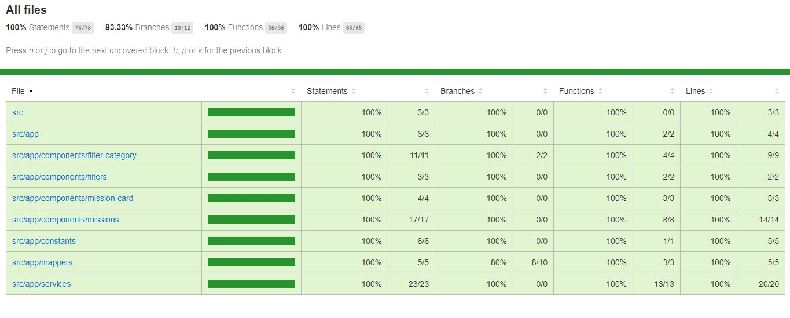

<p align="center">
  <h1 align="center">SpaceXLaunch with Angular Universal</h1>
  <p align="center">
    
  </p>
</p>

[](https://www.linkedin.com/in/rishabh-lakhmani/)


## Table of contents

- [Status](#status)
- [Quick start](#quick-start)
- [Getting Started](#getting-started)
- [Deployment](#deployment)
- [Test Cases](#test-cases)
- [Linting](#linting)
- [Author](#author)

## Status

### What's included
> Front-end Dependencies
- [x] Angular : 10.1.2
- [x] Angular CLI : 10.1.7
- [x] Angular Universal : 10.1.0
- [x] Rxjs : 6.6.3
- [x] lodash: 4.17.20

> SSR Dependencies
- [x] Node.js : 12.11.1
- [x] Express.js : 4.15.2

> Features
- [x] Routing
- [x] Server Side Rendering
- [x] Responsive Layout
- [x] Search Engine Optimization (SEO)
- [x] SpaceX API integration with GET method
- [x] Components
- [x] Services
- [x] Filter
- [x] Angular Resolver
- [x] Observables
- [x] Behaviour Subject
- [x] Test cases with [Karma](https://karma-runner.github.io/latest/index.html) & [Jasmine](https://jasmine.github.io/)

## Quick start

```bash
# clone the repo
git clone https://github.com/rishabhlakhmani/space-X-launch.git

# change directory
cd space-X-launch

# install the repo with npm
npm install

# start the server on client
ng serve

# start the server for server side rendering in development mode
npm run dev:ssr

```
in your browser go to [http://localhost:4200](http://localhost:4200)


## Getting Started

### Installation
* `npm install` (installing dependencies)

### Developement
* `npm run start`
* in your browser [http://localhost:4200](http://localhost:4200)

### Tests
* `npm run lint`
* `npm run test`


### Compilation
* `npm run build`       ( without SSR)
* `npm run build:ssr`   ( with SSR)

### Production
* `npm run serve:ssr`
* in your browser [http://localhost:4100](http://localhost:4100)

## Deployment

Application is deployed on https://spacex-launch-with-angular.herokuapp.com/ with [Heroku](https://www.heroku.com/)
 - develop branch is set to automatic deployment

## Lighthouse Audit


## Test Cases
- Covered All files with almost 100% coverage


## Linting
- 100% Linting Done with [ESLint](https://eslint.org/)


### Author
* Updated : 18/10/2020
* Author  : Rishabh Lakhmani
